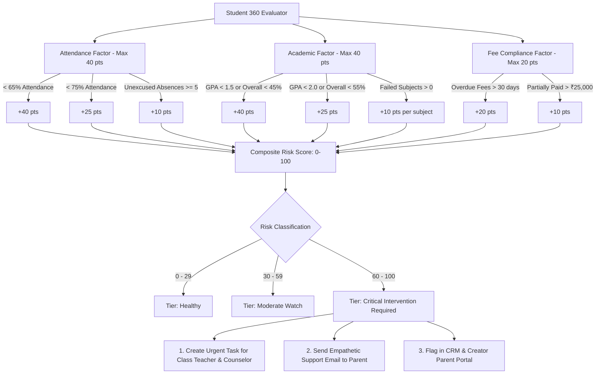

# Additional Feature: Automated 360° Student Early-Warning & Intervention Engine

## 1. Problem Identification

In conventional school administration, operational data is fragmented across independent departmental silos:
- **The Attendance Office** tracks unexcused absences and truancy.
- **The Academic Faculty** grades tests, homework, and term examinations.
- **The Accounts Department** monitors installment deadlines and overdue tuition fees.

### The Critical Flaw
Because these systems do not communicate automatically, **student distress is discovered reactively**—often at the end of the semester after a student has failed, accumulated chronic truancy, or when families face overwhelming overdue fee balances. 

School research demonstrates that:
1. Academic failure is preceded by a gradual drop in attendance ($< 75\%$).
2. Sustained absenteeism often correlates with family financial friction or disengagement.
3. Once a student drops below critical thresholds in multiple areas simultaneously, recovery is difficult and retention rates drop.

---

## 2. Strategic Rationale: Why This Feature Was Selected

We chose the **Automated 360° Student Early-Warning & Intervention Engine** because it transforms Zoho CRM from a passive system of record into an **active, predictive decision-support system**.

| Traditional Approach | 360° Early-Warning Engine |
| :--- | :--- |
| **Reactive**: Discovered during end-of-term report card generation or board audits. | **Proactive**: Daily/weekly automated risk scanning flags distress early. |
| **Siloed**: Teachers don't know about fee difficulties; accounts doesn't know about academic struggles. | **Unified 360°**: Synthesizes attendance, academic grades, and financial standing. |
| **Manual**: Teachers must manually compile lists of students with $<75\%$ attendance. | **Automated**: Deluge triggers automated counseling tasks and parental advisory emails. |

---

## 3. Algorithmic Risk Scoring Architecture

The engine computes a composite **Student Risk Score (0 to 100)** and corresponding **Health Index ($100 - \text{Risk Score}$)**:

$$\text{Total Risk Score} = \text{Attendance Risk (40\%)} + \text{Academic Risk (40\%)} + \text{Fee Compliance Risk (20\%)}$$



### Risk Tiers & Automated Actions

| Risk Tier | Score Range | Health Index | System Actions |
| :--- | :--- | :--- | :--- |
| **Healthy** | $0 - 29$ | $71 - 100$ | Normal monitoring. Clean badge in Creator Portal. |
| **Moderate Watch** | $30 - 59$ | $41 - 70$ | Flagged on Class Teacher's weekly advisory list. |
| **Critical Intervention** | $60 - 100$ | $0 - 40$ | 1. Automated high-priority Task assigned to Class Teacher & Guidance Counselor.<br>2. Automated empathetic parent email advisory sent with meeting link.<br>3. `Needs_Counseling_Intervention = true` stamped on student profile. |

---

## 4. Code Optimization & Scalability Rationale

When writing Deluge automation across thousands of student records, naive code will quickly hit **Zoho CRM Governor Limits** (API call limits per day, CPU timeout limits of 5 seconds per script execution). The implementation incorporates specific design decisions to guarantee scalability:

### 1. Single-Pass $O(N)$ Processing via Pre-Aggregated Rollups
- **The Naive Mistake**: In a batch run of 500 students, querying `Attendance`, `Exam_Results`, and `Fee_Invoices` individually per student requires $500 \times 3 = 1,500$ API calls, crashing execution.
- **Our Scalable Solution**: Scripts 02, 03, and 04 update aggregate rollup fields (`Attendance_Percentage`, `Cumulative_GPA`, `Total_Failed_Subjects`, `Fee_Status`, `Total_Outstanding_Fees`) directly on the `Students` master record whenever an event occurs. The Risk Engine reads these pre-computed fields in a single read per student ($O(N)$), consuming zero sub-queries!

### 2. Batch Pagination & Safety Boundaries
- The script executes in paginated chunks of 100 records:
  ```deluge
  studentsList = zoho.crm.getRecords("Students", pageIndex, pageSize);
  ```
- Handles thousands of students cleanly without stack overflow.

### 3. Idempotency & Alert Throttling (Notification Anti-Spam)
- To prevent spamming teachers and parents with duplicate alerts every time the engine runs, the script checks:
  ```deluge
  daysSinceLastAlert = zoho.currentdate.daysBetween(lastInterventionDate.toDate());
  if(daysSinceLastAlert >= 14) { ... }
  ```
- Enforces a 14-day cooldown window between automated high-priority intervention tasks.

### 4. Atomic CRM Updates
- All evaluated scores (`Risk_Score`, `Health_Index`, `Risk_Tier`, `Needs_Counseling_Intervention`) are packaged into a single `Map()` and written via a single atomic `zoho.crm.updateRecord()` call per student.

---

## 5. Deluge Implementation Reference

The complete script is available in:
[deluge_scripts/06_additional_feature_risk_engine.dg](file:///c:/Users/IT%2057/Desktop/project%2057/deluge_scripts/06_additional_feature_risk_engine.dg)

To schedule this automation:
1. Go to Zoho CRM $\rightarrow$ **Settings $\rightarrow$ Developer Space $\rightarrow$ Functions**.
2. Create Function: `runStudentEarlyWarningRiskEngine`.
3. Go to **Settings $\rightarrow$ Automation $\rightarrow$ Schedules**.
4. Create Schedule:
   - **Frequency**: Weekly (Every Monday at 05:00 AM)
   - **Action**: Execute Function `runStudentEarlyWarningRiskEngine`.
