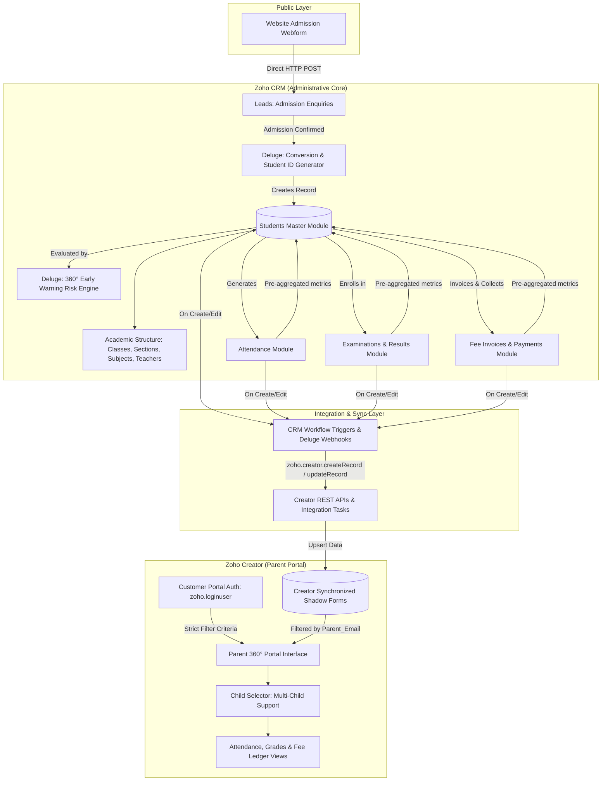

# Zoho CRM & Zoho Creator Integration Guide

## 1. System Integration Architecture

The solution uses a hybrid, event-driven architecture connecting **Zoho CRM** (the school administration back-office) with **Zoho Creator** (the secure parent-facing portal).



---

## 2. The End-to-End Operational Lifecycle

1. **Enquiry Capture**:
   - A prospective family submits the responsive [Admission Webform](file:///c:/Users/IT%2057/Desktop/project%2057/webform/admission_enquiry.html).
   - Data enters the Zoho CRM **Leads** module instantly. Honeypot traps suppress bot traffic.
2. **Admission Evaluation & Conversion**:
   - Admissions staff track interviews, document verification, and status changes.
   - When the status is set to `Admission Confirmed`, [Script 01](file:///c:/Users/IT%2057/Desktop/project%2057/deluge_scripts/01_lead_to_student_conversion.dg) executes:
     - Generates lifelong `Student_ID` (`STU-YYYY-XXXX`).
     - Creates the master record in `Students`.
     - Allocates class and academic year.
     - Initializes tuition invoice schedule.
     - Creates portal record in Creator.
3. **Daily Operations in Zoho CRM**:
   - Staff/Teachers record attendance in the `Attendance` module ([Script 02](file:///c:/Users/IT%2057/Desktop/project%2057/deluge_scripts/02_attendance_validation_rollup.dg) blocks duplicate entries and rolls up attendance %).
   - Teachers log marks in `Exam_Results` ([Script 03](file:///c:/Users/IT%2057/Desktop/project%2057/deluge_scripts/03_exam_marks_grade_calculator.dg) validates boundaries, calculates letter grades, and aggregates GPA).
   - Accounts records receipts in `Payments` ([Script 04](file:///c:/Users/IT%2057/Desktop/project%2057/deluge_scripts/04_fee_installment_payment_rollup.dg) rolls up payment sums, updates invoice statuses, and sets student fee balances).
4. **Synchronization to Parent Application**:
   - Updates from CRM trigger [Script 05](file:///c:/Users/IT%2057/Desktop/project%2057/deluge_scripts/05_crm_to_creator_sync.dg) which upserts Creator shadow forms.
5. **Parent Portal Experience**:
   - Parent logs into Zoho Creator Customer Portal using their registered email.
   - Creator filters data strictly where `Parent_Email == zoho.loginuser`.

---

## 3. Parent Authentication & Security Model (Row-Level Isolation)

### Strict Data Isolation
In Zoho Creator, parents must never view information belonging to other students. This is enforced through **Portal Row-Level Security**:

```deluge
// Deluge criteria applied on Creator Reports and Form Views:
Parent_Email == zoho.loginuser
```

### Multi-Child Architecture
If a parent has multiple children enrolled (e.g., one child in Grade 3 and another in Grade 8), both student records share the identical `Parent_Email`.
- The Creator Parent Portal dashboard presents a **Child Switcher Dropdown**:
  ```deluge
  // Creator Page Script
  myChildren = Students_Portal_View[Parent_Email == zoho.loginuser];
  if(input.selected_student_id == null && myChildren.count() > 0)
  {
      input.selected_student_id = myChildren.get(0).Student_ID;
  }
  
  activeStudent = Students_Portal_View[Student_ID == input.selected_student_id];
  // Renders profile, attendance, grades, and fees for active student
  ```
- This allows multi-child parents to switch seamlessly between children with a single login while preventing access to any other parent's records.

---

## 4. Integration Setup Steps

### Step 1: Create Zoho Connection (CRM to Creator)
1. In Zoho CRM, navigate to **Setup $\rightarrow$ Developer Space $\rightarrow$ Connections**.
2. Click **Create Connection** $\rightarrow$ select **Zoho OAuth**.
3. Connection Name: `zoho_creator_connection`.
4. Required Scopes:
   - `ZohoCreator.data.CREATE`
   - `ZohoCreator.data.READ`
   - `ZohoCreator.data.UPDATE`
5. Authorize and copy the Connection Link Name.

### Step 2: Build Creator Parent Application
1. In Zoho Creator, create an application: `School Parent Portal`.
2. Create the following forms:
   - `Students_Portal_View` (Fields: `CRM_Record_ID`, `Student_ID`, `Student_Name`, `Parent_Email`, `Parent_Name`, `Class_Name`, `Section_Name`, `Attendance_Percentage`, `Cumulative_GPA`, `Fee_Status`, `Outstanding_Amount`, `Last_Synced_Time`).
   - `Attendance_Portal_View` (Fields: `Student_ID`, `Attendance_Date`, `Status`, `Remarks`).
   - `Exam_Results_Portal_View` (Fields: `Student_ID`, `Exam_Name`, `Subject_Name`, `Marks_Obtained`, `Max_Marks`, `Grade`, `Result_Status`).
   - `Fees_Portal_View` (Fields: `Student_ID`, `Invoice_Number`, `Term_Name`, `Total_Amount`, `Amount_Paid`, `Outstanding_Amount`, `Payment_Status`, `Due_Date`).

### Step 3: Enable Customer Portal in Zoho Creator
1. In Zoho Creator $\rightarrow$ **Settings $\rightarrow$ Customer Portal**.
2. Enable Portal and configure access type: **Private Portal (Login Required)**.
3. User Type: Assign default permissions allowing `Read Only` access to `Students_Portal_View`, `Attendance_Portal_View`, `Exam_Results_Portal_View`, and `Fees_Portal_View`.
4. Set Default Report Filter: `Parent_Email == zoho.loginuser`.

### Step 4: Configure CRM Workflow Rules
1. **Module**: `Students` $\rightarrow$ **Rule Trigger**: On Create or Edit of any key metric (`Attendance_Percentage`, `Cumulative_GPA`, `Fee_Status`, `Total_Outstanding_Fees`).
2. **Action**: Custom Function $\rightarrow$ Select `syncStudentToCreatorPortal` ([Script 05](file:///c:/Users/IT%2057/Desktop/project%2057/deluge_scripts/05_crm_to_creator_sync.dg)).

---

## 5. Synchronization Strategy: Deduplication & Performance

| Scenario | Handling Strategy |
| :--- | :--- |
| **New Student Onboarded** | CRM creates record $\rightarrow$ Deluge executes `zoho.creator.createRecord` with unique `Student_ID`. |
| **Attendance / Exam Marks Logged** | Deluge in CRM updates aggregated metrics on Student master record $\rightarrow$ Trigger updates single row in Creator (`zoho.creator.updateRecord`). Avoids transmitting thousands of raw attendance rows. |
| **Fee Payment Settled** | Payment triggers instant balance calculation $\rightarrow$ Updates Invoice and Student records in CRM $\rightarrow$ Syncs updated outstanding balance to Creator in real-time. |
| **Network / API Failure** | Deluge wraps calls in `try/catch` or checks response status. If response code $\ne 3000$, error is logged to CRM Audit Notes for automated retry. |
