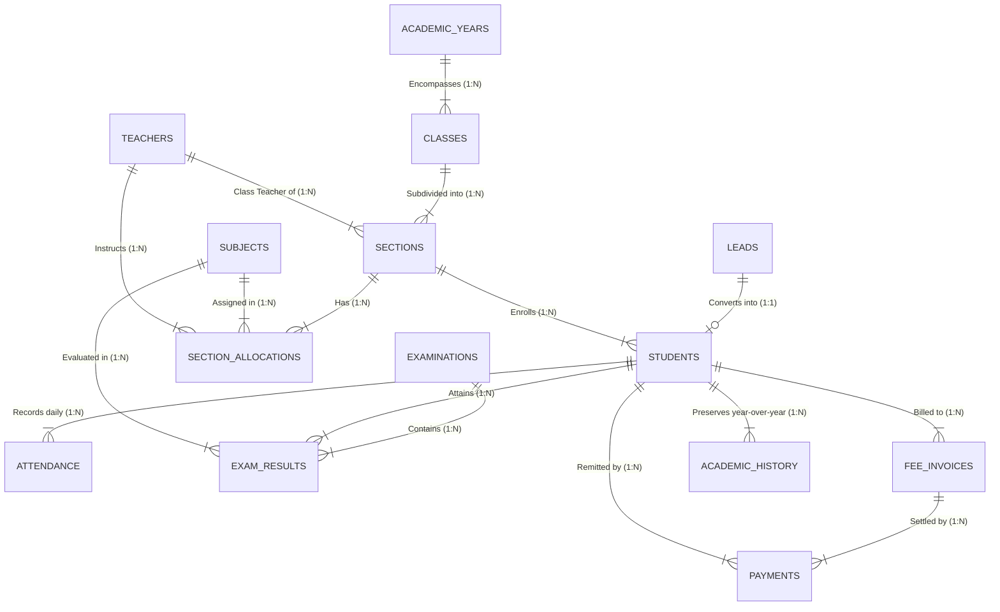

# Data Model & Data Dictionary: Zoho CRM School Management System

## 1. Architectural Overview & Entity-Relationship Model

The system utilizes a relational data model centered around the **Students** master module in Zoho CRM, connected to specialized operational modules for Admissions, Academic Structure, Attendance, Examinations, and Fee Management.

---

## 2. Complete Data Dictionary

### Module 1: `Leads` (Admissions Enquiries)
*Standard module configured for student admission inquiries.*

| Field Label | API Name | Data Type | Mandatory | Picklist Options / Formula / Default | Purpose |
| :--- | :--- | :--- | :--- | :--- | :--- |
| **First Name** | `First_Name` | Text (50) | Yes | - | Student's given name |
| **Last Name** | `Last_Name` | Text (50) | Yes | - | Student's surname |
| **Enquiry Number** | `Enquiry_Number` | Auto-Number | System | Prefix `ENQ-`, Start: `1001` | Unique tracking number for enquiry |
| **Date of Birth** | `Date_of_Birth` | Date | Yes | - | Applicant DOB for age criteria validation |
| **Gender** | `Gender` | Picklist | Yes | `Male`, `Female`, `Other` | Demographic reporting |
| **Grade Applying For** | `Grade_Applying_For` | Picklist | Yes | `Kindergarten`, `Grade 1` to `Grade 12` | Grade placement level |
| **Academic Year Applying** | `Academic_Year_Applying_For` | Picklist | Yes | `2025-2026`, `2026-2027` | Admissions cycle |
| **Parent / Guardian Name** | `Parent_or_Guardian_Name` | Text (100) | Yes | - | Primary parent/guardian contact |
| **Relationship to Student** | `Relationship_to_Student` | Picklist | Yes | `Father`, `Mother`, `Legal Guardian` | Family relationship |
| **Email** | `Email` | Email | Yes | - | Primary parent email (login credential) |
| **Phone** | `Phone` | Phone | Yes | - | Primary contact number for notifications |
| **Street** | `Street` | Text (255) | Yes | - | Residential street address |
| **City** | `City` | Text (50) | Yes | - | City of residence |
| **State** | `State` | Text (50) | Yes | - | State/Province |
| **Zip Code** | `Zip_Code` | Text (20) | Yes | - | Postal Code |
| **Lead Status** | `Lead_Status` | Picklist | Yes | `New Enquiry`, `Contacted`, `Campus Visit Scheduled`, `Interview Completed`, `Offer Extended`, `Admission Confirmed`, `Rejected`, `Withdrawn` | Admission pipeline stage |
| **Lead Source** | `Lead_Source` | Picklist | No | `Website Admission Webform`, `Campus Walk-in`, `Referral`, `Social Media` | Source tracking |
| **Converted Student ID** | `Converted_Student_ID` | Text (30) | Read-only | Stamped upon conversion | Target Student ID e.g. `STU-2025-0042` |
| **Student Lookup** | `Student_Lookup` | Lookup -> `Students` | No | - | Link to converted Student master profile |

---

### Module 2: `Students` (Master Profile)
*Central custom module maintaining master data for all enrolled students.*

| Field Label | API Name | Data Type | Mandatory | Details / Constraints | Purpose |
| :--- | :--- | :--- | :--- | :--- | :--- |
| **Student ID** | `Student_ID` | Text (30) | Yes (Unique) | System generated: `STU-{YYYY}-{0000}` | Unique lifelong student identifier |
| **Full Name** | `Name` | Text (100) | Yes | Concatenation of First & Last Name | Primary display name in CRM |
| **First Name** | `First_Name` | Text (50) | Yes | - | Student first name |
| **Last Name** | `Last_Name` | Text (50) | Yes | - | Student surname |
| **Date of Birth** | `Date_of_Birth` | Date | Yes | - | Verified DOB |
| **Gender** | `Gender` | Picklist | Yes | `Male`, `Female`, `Other` | Gender |
| **Academic Status** | `Academic_Status` | Picklist | Yes | `Active`, `Suspended`, `Graduated`, `Transferred`, `Withdrawn` | Current operational status |
| **Admission Date** | `Admission_Date` | Date | Yes | Default: `Today` | Date of official admission |
| **Current Academic Year** | `Current_Academic_Year` | Lookup -> `Academic_Years` | Yes | - | Active academic school year |
| **Current Class** | `Current_Class` | Lookup -> `Classes` | Yes | - | Grade/Class currently attended |
| **Current Section** | `Current_Section` | Lookup -> `Sections` | No | - | Assigned section (e.g. 10-A) |
| **Roll Number** | `Roll_Number` | Integer | No | Class section roster sequence | Section seat number |
| **Parent Name** | `Parent_Name` | Text (100) | Yes | - | Primary guardian name |
| **Parent Email** | `Parent_Email` | Email | Yes (Indexed) | Used for Zoho Creator Portal security | Portal authentication username |
| **Parent Phone** | `Parent_Phone` | Phone | Yes | - | SMS & emergency contact |
| **Total Working Days** | `Total_Working_Days` | Integer | Read-only | Rolled up via Deluge Script 02 | Aggregated school attendance days |
| **Days Present** | `Days_Present` | Decimal | Read-only | Rolled up via Deluge Script 02 | Actual days attended |
| **Days Absent** | `Days_Absent` | Integer | Read-only | Rolled up via Deluge Script 02 | Days truancy/absence count |
| **Attendance Percentage**| `Attendance_Percentage` | Decimal (5,2) | Read-only | Formula: `(Days_Present / Total_Days)*100` | Real-time attendance percentage |
| **Low Attendance Alert** | `Low_Attendance_Alert` | Checkbox | Read-only | Checked if attendance $< 75\%$ | Attendance compliance flag |
| **Cumulative GPA** | `Cumulative_GPA` | Decimal (3,2) | Read-only | Rolled up via Deluge Script 03 (0.00 to 4.00)| Overall grade point average |
| **Overall Academic %** | `Overall_Academic_Percentage` | Decimal (5,2) | Read-only | Rolled up via Deluge Script 03 | Cumulative marks percentage |
| **Total Failed Subjects**| `Total_Failed_Subjects` | Integer | Read-only | Count of subjects where Marks < Passing | Subject failure tracking |
| **Academic Probation** | `Academic_Probation_Flag` | Checkbox | Read-only | Checked if GPA $< 2.0$ or Failed $>0$ | Academic risk marker |
| **Fee Status** | `Fee_Status` | Picklist | Read-only | `Paid`, `Partially Paid`, `Unpaid`, `Overdue` | Global fee realization status |
| **Total Fees Billed** | `Total_Fees_Billed` | Currency (12,2) | Read-only | Sum of all linked invoices | Aggregate tuition billed |
| **Total Fees Collected** | `Total_Fees_Collected` | Currency (12,2) | Read-only | Sum of all payments received | Aggregate payments remitted |
| **Total Outstanding** | `Total_Outstanding_Fees` | Currency (12,2) | Read-only | `Total Billed - Total Collected` | Balance due from family |
| **Risk Tier** | `Risk_Tier` | Picklist | Read-only | `Healthy`, `Moderate Risk`, `High Risk` | 360° Early Warning output (Script 06) |
| **Health Index** | `Health_Index` | Integer (0-100)| Read-only | Evaluated composite student score | Student 360° health indicator |

---

### Module 3: `Academic_Years`
*Defines school academic cycles.*

| Field Label | API Name | Data Type | Mandatory | Purpose |
| :--- | :--- | :--- | :--- | :--- |
| **Academic Year Name** | `Academic_Year_Name` | Text (30) | Yes | e.g. `2025-2026`, `2026-2027` |
| **Start Date** | `Start_Date` | Date | Yes | Official school year commencement |
| **End Date** | `End_Date` | Date | Yes | Official school year conclusion |
| **Is Current Year** | `Is_Current_Year` | Checkbox | No | True for the currently active academic term |
| **Status** | `Status` | Picklist | Yes | `Upcoming`, `Current`, `Archived` |

---

### Module 4: `Classes` (Grades)
*Standard educational grade levels.*

| Field Label | API Name | Data Type | Mandatory | Purpose |
| :--- | :--- | :--- | :--- | :--- |
| **Class Name** | `Class_Name` | Text (50) | Yes | e.g. `Grade 10`, `Grade 11` |
| **Academic Level** | `Academic_Level` | Picklist | Yes | `Primary`, `Middle School`, `High School`, `Senior Secondary` |
| **Curriculum** | `Curriculum` | Picklist | Yes | `CBSE`, `ICSE`, `IB`, `Cambridge` |
| **Description** | `Description` | Text Area | No | Syllabus overview |

---

### Module 5: `Sections`
*Subdivisions of classes (e.g. 10-A, 10-B).*

| Field Label | API Name | Data Type | Mandatory | Purpose |
| :--- | :--- | :--- | :--- | :--- |
| **Section Name** | `Section_Name` | Text (50) | Yes | e.g. `10-A (Science)`, `10-B (Commerce)` |
| **Class Lookup** | `Class_Lookup` | Lookup -> `Classes` | Yes | Associated parent Class |
| **Academic Year** | `Academic_Year_Lookup` | Lookup -> `Academic_Years` | Yes | Operational year |
| **Class Teacher** | `Class_Teacher_Lookup` | Lookup -> `Teachers` | Yes | Primary faculty in charge of section |
| **Room Number** | `Room_Number` | Text (20) | No | Homeroom physical location |
| **Maximum Capacity** | `Capacity` | Integer | Yes | Classroom seat ceiling (e.g. 40) |
| **Enrolled Count** | `Enrolled_Count` | Integer | Read-only | Active students currently assigned |

---

### Module 6: `Subjects`
*Academic curriculum subjects.*

| Field Label | API Name | Data Type | Mandatory | Purpose |
| :--- | :--- | :--- | :--- | :--- |
| **Subject Name** | `Subject_Name` | Text (100) | Yes | e.g. `Mathematics`, `Physics`, `English Literature` |
| **Subject Code** | `Subject_Code` | Text (20) | Yes (Unique) | e.g. `MATH-101`, `ENG-201` |
| **Department** | `Department` | Picklist | Yes | `STEM`, `Humanities`, `Languages`, `Fine Arts` |
| **Credits / Weightage**| `Credits` | Decimal (3,1) | Yes | Course credit hours (e.g. 4.0) |

---

### Module 7: `Teachers` (Faculty)
*Staff directory for instructors and class teachers.*

| Field Label | API Name | Data Type | Mandatory | Purpose |
| :--- | :--- | :--- | :--- | :--- |
| **Teacher ID** | `Teacher_ID` | Text (30) | Yes (Unique) | e.g. `FAC-104` |
| **Full Name** | `Name` | Text (100) | Yes | Instructor name |
| **Email** | `Email` | Email | Yes | Official school email |
| **Phone** | `Phone` | Phone | Yes | Contact phone number |
| **Specialization** | `Specialization` | Text (100) | No | e.g. `M.Sc Pure Mathematics` |
| **Status** | `Status` | Picklist | Yes | `Active`, `On Leave`, `Resigned` |

---

### Module 8: `Class_Allocations` (Junction Module)
*Resolves the many-to-many relationship: Which Teacher teaches which Subject in which Section.*

| Field Label | API Name | Data Type | Mandatory | Purpose |
| :--- | :--- | :--- | :--- | :--- |
| **Allocation Title** | `Name` | Text (100) | System | e.g. `10-A - Mathematics - Dr. Kumar` |
| **Section Lookup** | `Section_Lookup` | Lookup -> `Sections` | Yes | Target Section |
| **Subject Lookup** | `Subject_Lookup` | Lookup -> `Subjects` | Yes | Target Subject |
| **Teacher Lookup** | `Teacher_Lookup` | Lookup -> `Teachers` | Yes | Assigned Instructor |
| **Academic Year** | `Academic_Year_Lookup` | Lookup -> `Academic_Years` | Yes | School year |
| **Periods Per Week** | `Periods_Per_Week` | Integer | No | Timetable frequency |

---

### Module 9: `Attendance`
*Daily student attendance records.*

| Field Label | API Name | Data Type | Mandatory | Details / Constraints | Purpose |
| :--- | :--- | :--- | :--- | :--- | :--- |
| **Attendance Record Name**| `Name` | Text (100) | System | Auto-generated title | Display label |
| **Student Lookup** | `Student_Lookup` | Lookup -> `Students` | Yes | Target student | Student reference |
| **Date** | `Attendance_Date` | Date | Yes | Default: `Today` | Attendance date |
| **Status** | `Status` | Picklist | Yes | `Present`, `Absent`, `Late`, `Excused` | Attendance outcome |
| **Section Lookup** | `Section_Lookup` | Lookup -> `Sections` | Yes | - | Section attended |
| **Marked By** | `Marked_By_Teacher` | Lookup -> `Teachers` | No | - | Teacher who took attendance |
| **Remarks / Reason** | `Remarks` | Text (255) | No | Reason for absence/tardiness | Notes |
| **Composite Key** | `Composite_Key` | Text (80) | Yes (Indexed) | `Student_ID + "_" + Date` | **Enforces strict duplicate prevention** |

---

### Module 10: `Examinations`
*Schedules for assessments, term exams, and tests.*

| Field Label | API Name | Data Type | Mandatory | Purpose |
| :--- | :--- | :--- | :--- | :--- |
| **Exam Name** | `Name` | Text (100) | Yes | e.g. `Mid-Term Assessment 2025-26` |
| **Academic Year** | `Academic_Year_Lookup` | Lookup -> `Academic_Years` | Yes | Target school year |
| **Class Lookup** | `Class_Lookup` | Lookup -> `Classes` | Yes | Target grade |
| **Exam Type** | `Exam_Type` | Picklist | Yes | `Unit Test`, `Mid-Term`, `Final Board Exam`, `Practical` |
| **Start Date** | `Start_Date` | Date | Yes | Exam start date |
| **End Date** | `End_Date` | Date | Yes | Exam conclusion date |

---

### Module 11: `Exam_Results` (Student Marks)
*Individual subject scores per student per examination.*

| Field Label | API Name | Data Type | Mandatory | Details / Constraints | Purpose |
| :--- | :--- | :--- | :--- | :--- | :--- |
| **Result Title** | `Name` | Text (100) | System | e.g. `Aarav Sharma - Mid-Term - Math` | Display identifier |
| **Exam Lookup** | `Exam_Lookup` | Lookup -> `Examinations` | Yes | Examination event | Parent exam |
| **Student Lookup** | `Student_Lookup` | Lookup -> `Students` | Yes | Student evaluated | Student reference |
| **Subject Lookup** | `Subject_Lookup` | Lookup -> `Subjects` | Yes | Curricular subject | Subject reference |
| **Marks Obtained** | `Marks_Obtained` | Decimal (5,2) | Yes | Must be $\ge 0$ and $\le \text{Max Marks}$ | Raw score |
| **Max Marks** | `Max_Marks` | Decimal (5,2) | Yes | Default: `100.00` | Assessment total |
| **Passing Marks** | `Passing_Marks` | Decimal (5,2) | Yes | Default: `40.00` | Minimum score to pass |
| **Percentage** | `Percentage` | Decimal (5,2) | Read-only | Calculated via Deluge Script 03 | Percentage achieved |
| **Grade** | `Grade` | Picklist | Read-only | `A+`, `A`, `B`, `C`, `D`, `F` | Assigned letter grade |
| **Grade Point** | `Grade_Point` | Decimal (3,2) | Read-only | Scale 0.0 to 4.0 | GPA weight |
| **Result Status** | `Result_Status` | Picklist | Read-only | `Pass`, `Fail`, `Absent` | Outcome flag |
| **Teacher Remarks** | `Teacher_Remarks` | Text (255) | No | Qualitative feedback | Notes |

---

### Module 12: `Fee_Invoices`
*Installment billing schedules for tuition and other school fees.*

| Field Label | API Name | Data Type | Mandatory | Details / Constraints | Purpose |
| :--- | :--- | :--- | :--- | :--- | :--- |
| **Invoice Number** | `Invoice_Number` | Text (50) | Yes (Unique) | e.g. `INV-2025-0042-T1` | Billing reference |
| **Student Lookup** | `Student_Lookup` | Lookup -> `Students` | Yes | Enrolled student | Student reference |
| **Academic Year** | `Academic_Year_Lookup` | Lookup -> `Academic_Years` | Yes | Term year | Year reference |
| **Term / Installment**| `Term_Name` | Picklist | Yes | `Admission & Term 1`, `Term 2`, `Term 3`, `Annual Lump Sum` | Installment type |
| **Due Date** | `Due_Date` | Date | Yes | Deadline for payment | Arrears trigger date |
| **Total Fee Amount** | `Total_Fee_Amount` | Currency (12,2) | Yes | Total billed sum | Total fee payable |
| **Amount Paid** | `Amount_Paid` | Currency (12,2) | Read-only | Rolled up via Deluge Script 04 | Cumulative collected |
| **Outstanding Amount**| `Outstanding_Amount` | Currency (12,2) | Read-only | Formula: `Total_Fee - Amount_Paid` | Remaining balance |
| **Payment Status** | `Payment_Status` | Picklist | Read-only | `Paid in Full`, `Partially Paid`, `Unpaid`, `Overdue` | Real-time realization |

---

### Module 13: `Payments` (Receipts)
*Financial transaction records settling fee invoices.*

| Field Label | API Name | Data Type | Mandatory | Details / Constraints | Purpose |
| :--- | :--- | :--- | :--- | :--- | :--- |
| **Receipt Number** | `Name` / `Receipt_No`| Auto-Number / Text | Yes (Unique) | Prefix `RCP-`, Start `50001` | Official payment voucher |
| **Invoice Lookup** | `Invoice_Lookup` | Lookup -> `Fee_Invoices` | Yes | Linked invoice | Invoice reference |
| **Student Lookup** | `Student_Lookup` | Lookup -> `Students` | Yes | Enrolled student | Student reference |
| **Payment Date** | `Payment_Date` | Date | Yes | Default: `Today` | Transaction timestamp |
| **Amount** | `Amount` | Currency (12,2) | Yes | Must be $> 0$ | Remitted sum |
| **Payment Method** | `Payment_Method` | Picklist | Yes | `Online Gateway`, `Bank Transfer / NEFT`, `UPI`, `Cheque`, `Cash` | Tender channel |
| **Transaction ID** | `Transaction_ID` | Text (100) | No | Bank / Gateway reference # | Verification ID |
| **Payment Status** | `Payment_Status` | Picklist | Yes | `Cleared / Success`, `Pending Clearance`, `Bounced / Failed` | Settlement status |

---

### Module 14: `Academic_History` (Historical Progression)
*Preserves historical records as students progress year-over-year.*

| Field Label | API Name | Data Type | Mandatory | Purpose |
| :--- | :--- | :--- | :--- | :--- |
| **History Record Title**| `Name` | Text (100) | System | e.g. `Aarav Sharma - Grade 9 History (2024-25)` |
| **Student Lookup** | `Student_Lookup` | Lookup -> `Students` | Yes | Lifelong student master profile |
| **Academic Year Completed**| `Academic_Year_Completed` | Text (30) | Yes | Previous year reference |
| **Class Completed** | `Class_Completed` | Text (50) | Yes | Completed grade |
| **Final Attendance %** | `Final_Attendance_Percentage` | Decimal (5,2) | Yes | Year-end attendance rate |
| **Final GPA** | `Final_GPA` | Decimal (3,2) | Yes | Year-end cumulative GPA |
| **Promoted Status** | `Promoted_Status` | Picklist | Yes | `Promoted to Next Grade`, `Retained`, `Conditional Promotion` |
| **Archival Date** | `Archival_Date` | Date | Yes | Date of rollover |

---

## 3. Historical Data Preservation Strategy

To satisfy the requirement: *"The system should also preserve relevant historical information as students progress through different academic years"*:
1. **Lifelong Primary Key (`Student_ID`)**: A student retains the exact same `Student_ID` throughout their tenure (e.g., Kindergarten through Grade 12).
2. **Year-End Archival & Promotion Automation**:
   - At the close of an academic year, a Deluge batch function reads the student's final stats (Attendance %, GPA, Exam breakdown, Fee compliance).
   - It writes an immutable snapshot record into `Academic_History`.
   - It updates the student's `Current_Academic_Year`, `Current_Class`, and `Current_Section` to the new grade.
   - It resets the active attendance counters and term fee ledger for the fresh school year while retaining access to all historical records via the `Academic_History` related list.
